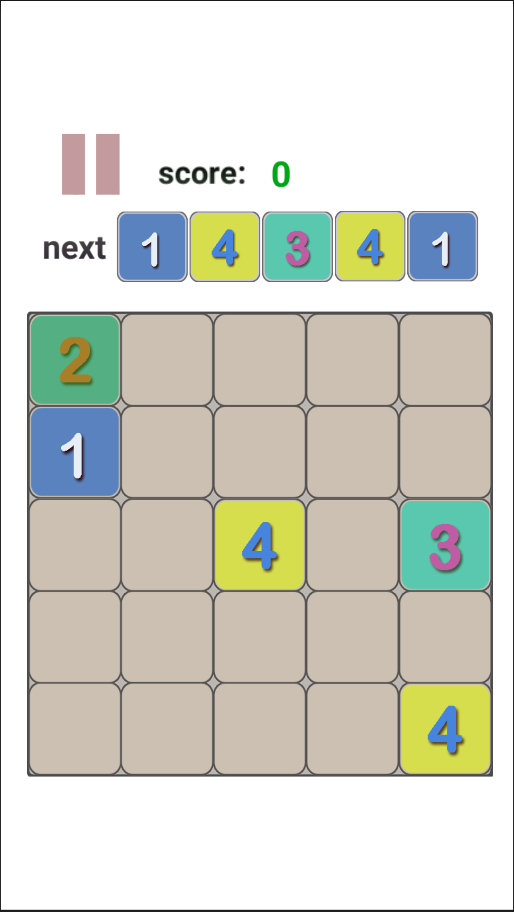
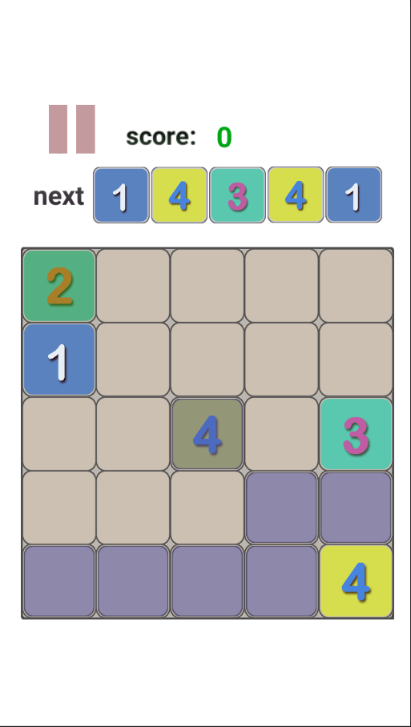
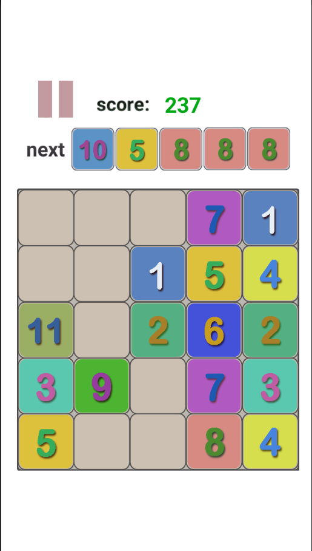
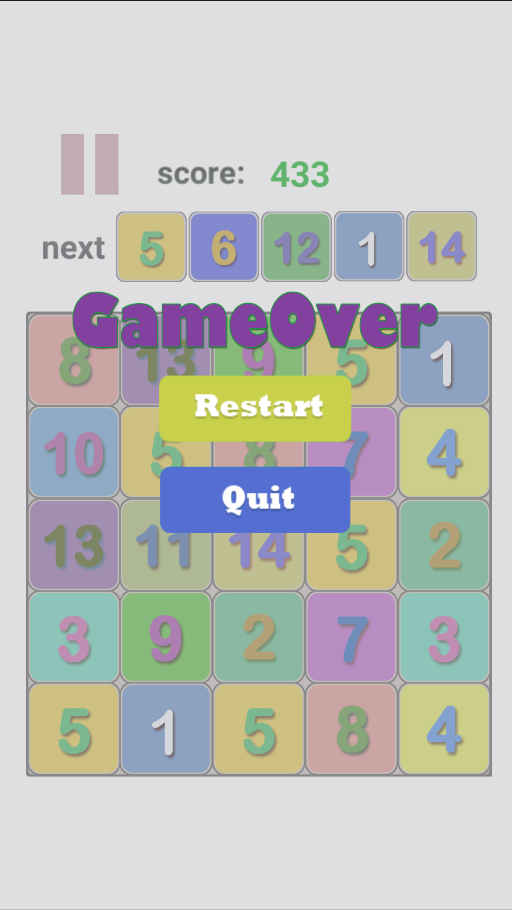

# battle21
battle21是基于Unity3d的一个益智类的消除游戏。

## 玩法

界面为5x5的正方形，进入游戏后会随机出现5个4以内的数字，点击某一个数字，如果界面中的格子是当前数
字可以到达的（数字可以直线或者对角线移动），那么格子的颜色会变成灰色，然后点击某个灰色的格子，
如果格子中有数字并且等于当前的数字，那么当前数字会移动到选择的灰色格子下，数字会加1并且得到数字加1的分数，然后界面中加载Next
中的数字。直到数字中得到21或者所有的数字都没有可以到达的格子游戏结束。

## 截图

